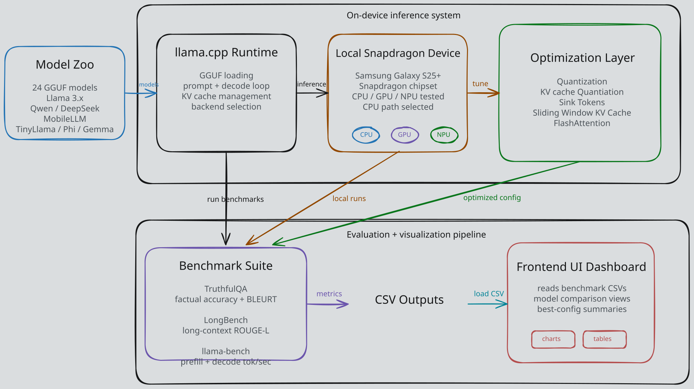

## Snapdragon Edge LLM Inference

Exploration and evaluation of efficient large language model (LLM) inference on the Samsung S25+ edge device. We investigate system-level and model-level optimizations—including quantization strategies, KV-cache configurations, flash attention, hyperparameters (batch size, KV-Cache Size, Temperature etc.) and sliding window + attention sinks to examine trade-offs between throughput, accuracy, and energy efficiency under real deployment constraints using Llamabench, Longbench, and TruthfulQA as evaluation metrics.

### Overview

<p align="center">
  
</p>


### Directory Structure

```
/inference

Holds all scripts and results related to inference. Directions on how to run inference located in README inside of inference/.

/analysis

Data visualization tool. Upload CSV and get complete visualizations for hyperparameters, models, and evaluation metrics.

/llama.cpp

Llamacpp fork adjusted to work with --context-shift and --keep tokens. Hexagon branch - compatible with Snapdragon chips.
```

#### Example Visuals

Below are example visualizations of experiments generated from the analysis pipeline, demonstrating how inference results and hyperparameter sweeps can be explored and compared.

<p align="center">
  
</p>

<p align="center">
  
</p>

<p align="center">
  
</p>

<p align="center">
  
</p>

